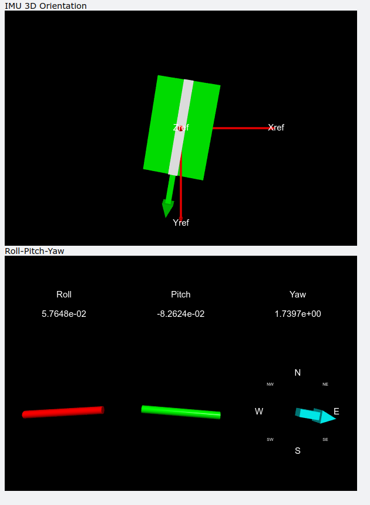

# Embedded Motion Tracker 

This was part of a larger project run on an Atmega328 to create an embedded motion tracker using a PNAV sensor to measure acceleration, angular velocity and magnetic fields.
The code here reads the results from serial and visualises them using VPython.

(Ported from an old version in Python2)

